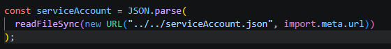

Comandos para iniciar proyecto:
1) En la carpeta E-commerce:
        Instalaciones:
           - npm init vite@latest
           - npm i bootstrap@5.3.8. 
        Para arrancar el proyecto:
            - npm run dev
3) En la carpeta Back:
        Instalaciones:
            - npm i bcrypt express express-session jsonwebtoken mongodb mongoose cors method-override dotenv 
        Para arrancar el proyecto: 
            - npm run dev 

Para conectar firebase:
1) hay que entrar a proyecto -> configuración -> cuentas de servicio
2) apretamos el boton azul de generar nueva clave privada, y la agregamos a la carpeta raiz del back
3) Copiamos la direccion del archivo recien agregado a esta parte de firebase.js:

    

